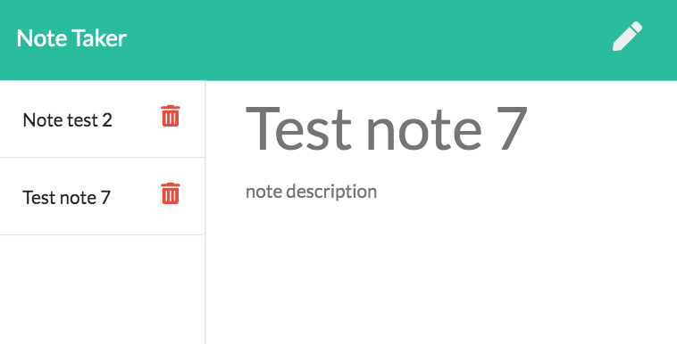

# note-taker

This application uses an express.js server to deploy a note taking application. The user can click on the "Get Started" button on the landing page to get to the notes. There, the user can type and save a note, select a note to view it, and delete a note.

[Click here to see the note taker application.](https://rlforsyth-note-taker.herokuapp.com/)

